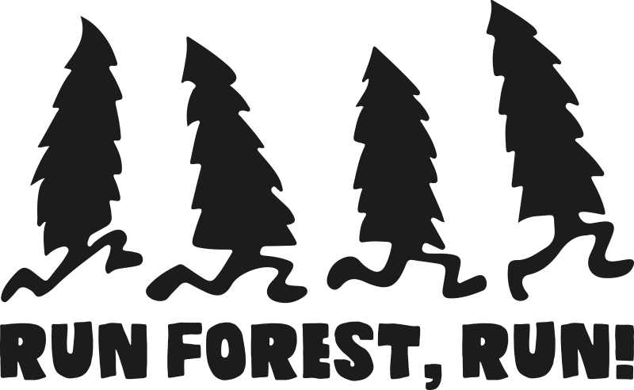

  

  

  The FastForest group measures and models energy, water, and carbon fluxes between terrestrial ecosystems and the atmosphere. We are running the <a href="https://www.todo.com">ICOS</a> class 1 ecosystem site <a href="https://www.todo.com">FR-Hes</a> with a eddy covariance flux tower and a ton of ancillary measurements. We are co-developping the ecosystem model <a href="https://www.todo.com">MuSICA</a> as well as the global land surface models <a href="https://www.todo.com">CABLE-POP</a> and <a href="https://www.todo.com">CABLE-POP</a>.
  

We develop innovative methods to process high-resolution flux data and use them to understand ecosystem processes.

  

  
  

  
...

