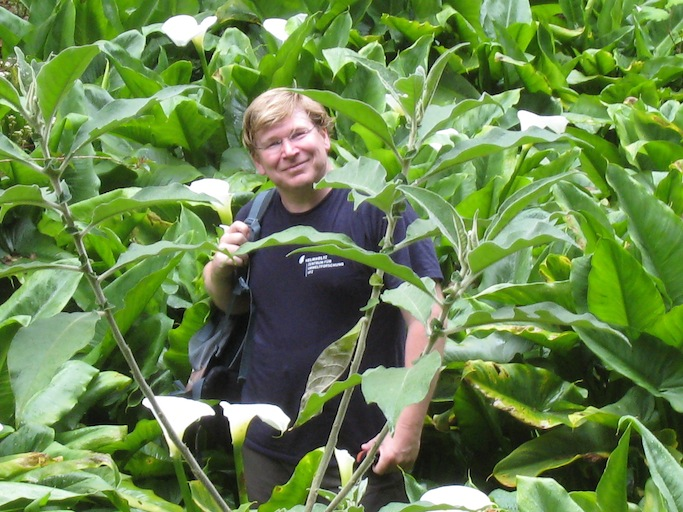

<b>Matthias Cuntz</b>, Directeur de Recherche.

Matthias received his PhD in physics and was subsequently working in atmospheric physics (Paris), biology (Canberra), biogeochemical cycles (Jena), and hydrology (Leipzig). He combines measurements and modelling to understand and describe mathematically the processes behind the exchanges of the atmosphere with the biosphere. He is Co-PI of the class 1 ICOS ecosystem site FR-Hes. He is key developer of the ecosystem model MuSICA and of the global land surface model CABLE-POP. This allows him to combine measurements and modelling to understand and describe mathematically the processes behind the exchanges of the atmosphere with the biosphere, scaling from single leaves and greenhouse observations over fluxes measured and modelled at the ecosystem up to the continental scale.

<a href="matthias_cuntz.md">Personal page</a>&nbsp;&nbsp;&nbsp;
<a href="mailto:matthias.cuntz@inrae.fr">E-Mail</a>&nbsp;&nbsp;&nbsp;
<a href="https://scholar.google.com/citations?user=s93VuhMAAAAJ">Google scholar</a>

&nbsp;

