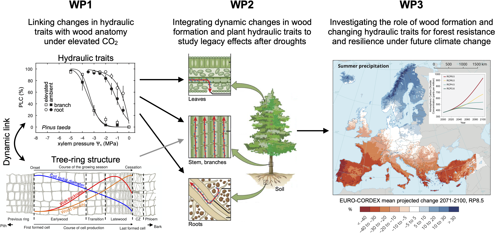
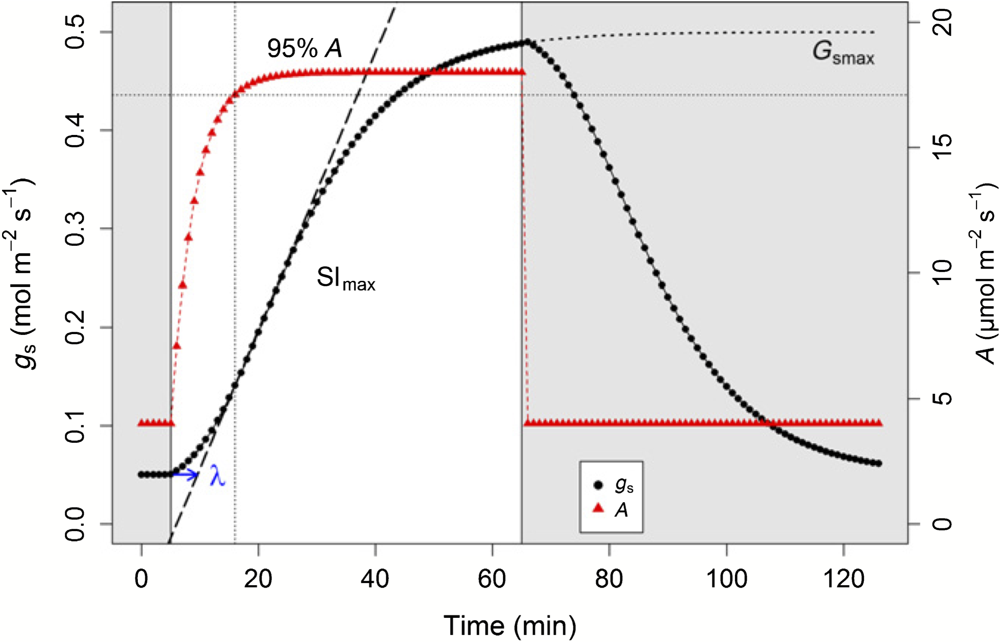
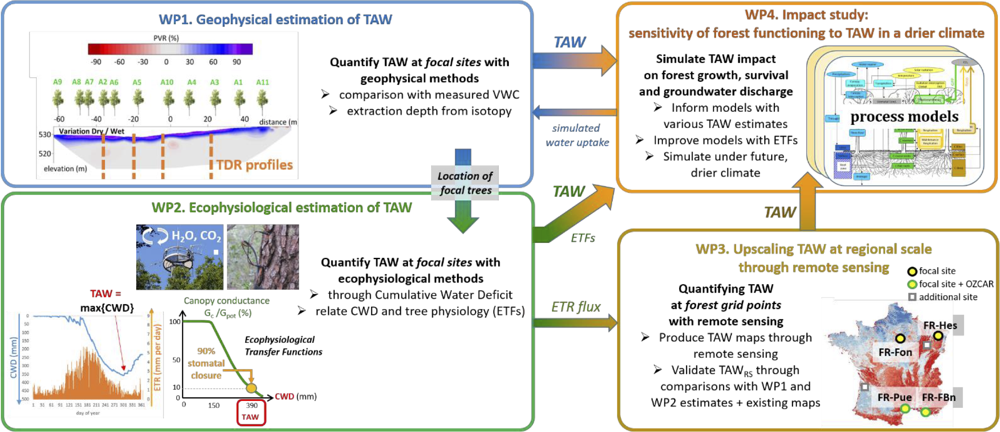
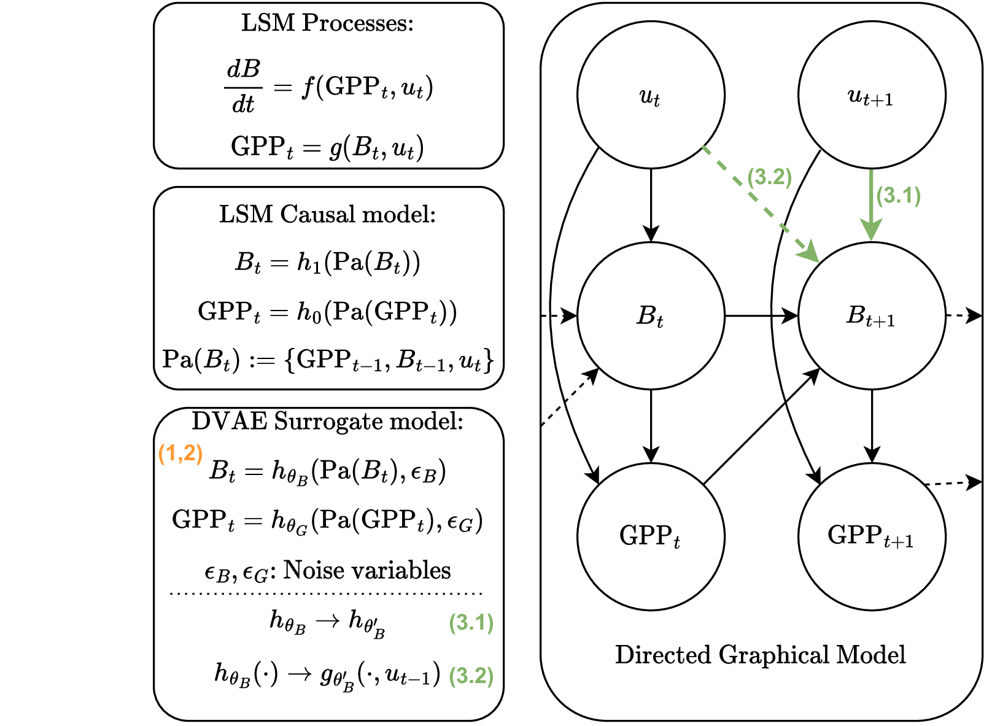
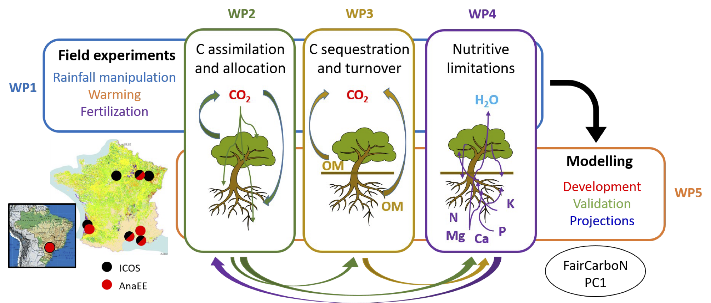

## Current projects

<ul>
  <li><a href="#phydraucc">PHydrauCC</a></li>
  <li><a href="#slowstom">SlowStom</a></li>
  <li><a href="#tawtree">TAW-tree</a></li>
  <li><a href="#lsmxai">LSMxAI</a></li>
  <li><a href="#droughtforc">Drought ForC</a></li>
  <li><a href="#europedrought">EuropeDrought</a></li>
</ul>

<a href="#top">Top</a>

### PHydrauCC – Plant Hydraulic Functioning in face of Climate Change

<b>Funding</b>: French National Research Agency (ANR) - ANR-21-CE02-0033

<b>Partners</b>: Silva (INRAE Nancy), ISPA (INRAE Bordeaux). Coordinated by Matthias Cuntz (Silva)

  

We propose to establish a strong link between wood anatomy and hydraulic traits as well as their changes with increasing atmospheric CO2 concentrations. We will examine whether elevated CO2 alters the anatomical characteristics of trees and identify changes in wood structure related to key plant hydraulic traits (vulnerability to cavitation, conductivity, and water storage) from roots to branches and leaves and across a range of key woody species. By incorporating these results in mechanistic soil-plant-atmosphere and large-scale vegetation models, we will ascertain whether the interplay of tree-ring formation and hydraulic functioning can lead to strong ecosystem responses to elevated CO2, warming and drought that can be carried over into future years. This will help to investigate the consequences of such tight bonds of water and carbon relations on the resistance and resilience of trees under future climate change, and to increase our ability to forecast future environmental impacts on tree function and carbon sequestration potential.

The specific objectives and the associated hypotheses (a-j) of PHydrauCC are:
<ol type="1" start=1>
  <li>Assemble the first dataset of changes of hydraulic traits and wood anatomy under elevated CO2 from several Free-Air CO2 Enrichment (FACE) sites (Table 1). Examine whether elevated CO2 will alter the structural (wood anatomy, tree-ring density, early- and late-wood proportion) and physiological (conductivity, capacitance, resistance to embolism) characteristics of trees across a range of species. Link the measured hydraulic traits with detailed observations on xylem anatomy. (Work package 1)
  <ol type="a" start=1>
    <li>Elevated CO2 leads to enhanced photosynthesis and increased leaf area. To acclimate, elevated CO2 will affect the radial growth rate of trees characterized by a larger sapwood area to supply water, which will increase water storage capacity in all species.</li>
    <li>Plants increase the fraction of carbon allocated to roots under elevated CO2. Therefore, elevated CO2 will affect the resistance to embolism more in roots than in branches. However, trajectories of xylem safety vs. efficiency trade-offs along the root-to-branch continuum will differ in relation to species’ overall resistance to drought.</li>
    <li>Species-specific tree-ring structure changes in anatomical traits with elevated CO2 influence the probability of loss of conductivity and its subsequent effects on plant’s hydraulic capabilities, i.e. water storage capacity and whole root-to-leaf conductance.</li>
  </ol>
  </li>
  
  <li>Use the observed changes from objective 1 to determine whether differences in tree-ring structure and hydraulic traits can be used to predict different strategies of stomatal regulation, water use, carbon assimilation, and tree growth during and after heat waves and droughts. We propose to improve the multi-layer hydraulically-driven ecosystem model MuSICA with a newly-developed model of tree ring formation, using partially coordinated hydraulic traits. (Work package 2)
  <ol type="a" start=4>
    <li>Partly coordinated hydraulic traits lead to different ecosystem responses to drought than fully coordinated (combined) hydraulic traits.</li>
    <li>The changes in plant hydraulic capacity and capacitance will allow plants growing under elevated CO2 to be less affected by reduced soil moisture and increased temperature than plants growing under current CO2, potentially maintaining high carbon assimilation under drought and heat waves.</li>
    <li>Combining plant hydraulics with wood growth depending on both water and sugar availability leads to pronounced legacy effects after droughts.</li>
    <li>The diverse responses of European forest sites to drought can be explained by the combined plant hydraulics-tree-ring formation model.</li>
  </ol>
  </li>

  <li>Assess forest resilience to future climate change on continental scale under the dichotomy of the very different hydraulic strategies of conifers and broadleaved trees. Develop a parsimonious version of the hydraulic and tree-ring formation model suitable for large-scale vegetation models and incorporate it in the land surface model Cable-POP. (Work package 3)
  <ol type="a" start=8>
    <li>Droughts and heat waves will have more severe effects on plant resistance and resilience in an explicit growth-hydraulics model than in a model based on empirical functions of water limitations.</li>
    <li>Describing partly coordinated hydraulic traits and wood formation in land surface models will improve forest’s responses to droughts and heat waves.</li>
    <li>Direct and legacy effects in the combined model of tree-ring formation and plant hydraulics will decrease estimates of the land carbon sink in mid and high latitude forests under climate change scenarios.</li>
  </ol>
  </li>
</ol>

We expect that the new combined model of tree-ring formation and plant hydraulics, developed with functional links and data from the FACE experiments, will display hysteresis effects in plant water transport wit changing soil water conditions and elevated temperatures, and that it will show legacy effects in plant growth for several years after major drought and heat wave events. The effects should depend on plant and wood type and should manifest differently in trees with large xylem conduits (i.e. vessels: broadleaved trees) and in trees with small conduits (tracheids: conifers). Hysteresis and legacy effects are phenomena that are absent from current vegetation models. We also expect that the hydraulic traits, i.e. conductance, capacitance, and vulnerability to embolism, might not be enough to explain the strong responses to drought of some broadleaved species, but that different strategies such as for example leaf shedding must be added. We will then evaluate drought-related risks under climate change in temperate and boral forests, with a special interest in the different hydraulic strategies of broadleaved angiosperms compared to needle-leaved gymnosperms.

<a href="#top">Top</a>

### SlowStom

<b>Funding</b>: Laboratory of Excellence Advanced Research on the Biology of Tree and Forest Ecosystems (ARBRE; grant ANR-11-LABX-0002-01) and Université de Lorraine.

<b>Partners</b>: Groups FARE and ForeSTree of Silva (INRAE Nancy). Coordinated by Emilie Joetzjer (ForeSTree).

  

Plants constantly adapt photosynthesis and stomatal conductance to prevailing environmental conditions. Photosynthesis can adjust in seconds to changes in irradiance while stomatal conductance responds lagged by a few minutes up to almost an hour. There is a fundamental difference between shade flecks (sudden decrease in irradiance) and sun flecks (sudden increase of irradiance). In the former case, stomata are open, CO2 is (mostly) not limiting, and photosynthesis can immediately respond to the drop in irradiance. In the latter case, stomata are more closed, limiting the supply of CO2 to photosynthesis so that it also shows a lagged response to increased irradiance, even though still faster than stomatal conductance (cf. figure on title page). This manoeuvre between coupled and uncoupled situations happens continuously on partly overcast days with intermittent light conditions.

Hence, the questions on ecosystem scale about this well-known phenomenon on leaf scale are:
<ul>
  <li>Can uncoupled photosynthesis and stomatal conductance of the canopy due to sun/shade flecks be detected on ecosystem scale?</li>
  <li>Are there situations with uncoupled canopy photosynthesis and canopy conductance for example on partly overcast days?</li>
</ul>

Ecosystem models use coupled descriptions of photosynthesis and stomatal conductance. They use so-called steady-state descriptions for stomatal and canopy conductance. It was shown that these steady-state descriptions cannot fully comprehend the behaviour of photosynthesis and stomata in intermittent light conditions but that non-steady-state descriptions of stomatal conductance are needed during these unsteady times. Almost all ecosystem models also calculate with fixed modelling time steps, which are mostly given by the time resolution of the flux observations and the meteorological forcing data. Model parameters are hence adapted for mean conditions during the model time step, which theoretically should be different during stable and intermittent meteorological conditions.

Questions for the description of canopy conductance in ecosystem models arise:
<ul>
  <li>How big is the influence of non-steady state descriptions of canopy conductance on ecosystem fluxes of H2O and CO2 in ecosystem models?</li>
  <li>Do dynamic descriptions of canopy conductance improve estimates of mean ecosystem fluxes of half an hour under stable and intermittent meteorological conditions compared to steady-state descriptions using adaptive time stepping?</li>
  <li>Is it possible to use closed integral forms of non-steady state canopy conductance with a fixed time stepping in ecosystem models to calculate ecosystem fluxes in different meteorological conditions?</li>
</ul>

These questions lead to the specific objectives of this project:
<ol>
  <li>Use Fourier analysis (spectrograms) of high-frequency data of eddy covariance (20 Hz) to analyse maximum time scales of contributing turbulent eddies to observed eddy covariances.</li>
  <li>Use continuous wavelet transforms to calculate ecosystem fluxes with one-minute resolution.</li>
  <li>Use high-frequency meteorologic data (20 s) together with the one-minute ecosystem fluxes for the calculation of canopy conductance.</li>
  <li>Use coupled neural networks on the calculated ecosystem fluxes to derive canopy photosynthesis with one-minute resolution.</li>
  <li>Use irradiance to classify stable and intermittent meteorological conditions.</li>
  <li>Analyse the coupling of photosynthesis and canopy conductance under different meteorological conditions.</li>
  <li>Implement transient and integral formulations of non-steady-state stomatal conductance in the ecosystem model MuSICA.</li>
  <li>Analyse the performance of different descriptions of stomatal conductance and different time stepping schemes on ecosystem fluxes under diverse meteorological conditions.</li>
</ol>

Objectives 1, 3, 4, 6, 7, and 8 have never been tackled before and extend current data processing and analysis
of eddy covariance data.

<a href="#top">Top</a>

### TAW-tree - Total Available Water to Tree: a key, missing parameter for assessing the vulnerability of forests in the face of climate change

<b>Funding</b>: French National Research Agency (ANR)

<b>Partners</b>: ESE (Université Paris-Saclay), METIS (Université Paris-Saclay), URFM (INRAE Avignon), CEFE (CNRS Montpellier), Silva (INRAE Nancy), GEOPS (Université Paris-Saclay). Coordinated by Nicolas Delpierre (ESE)

  

Forests cover one-third of the Earth's land area and are central in the global carbon and water cycles. They contribute to mitigating ongoing climate change by absorbing 25% of the annual anthropogenic CO2 emissions1. Forests also play an important role in the distribution of precipitation and continental water dynamics, contributing about 60% of land evapotranspiration. Yet the future of forests is uncertain in the current context of climate change4. This is because trees are sessile organisms that depend on soil reserves to access water. With climate change, the world's forests, like all terrestrial ecosystems, are facing an increase in atmospheric evaporative demand. In addition, in western central Europe and the Mediterranean area, climate models predict a likely increase in edaphic droughts in the coming decades. The response of forests to increased water deficit will depend largely on their access to soil water, which is to date very poorly characterized. Therefore, we need comprehensive approaches and interdisciplinary research to take into account the hydrological and hydrogeological parameters of the critical zone in the response of forests to water deficit.

For a long time, the so-called "available water content" (AWC, in millimetres of water) has been identified as a key parameter in the modelling of forest water balance, carbon balance, tree growth and survival. Yet, the concept of AWC has two main drawbacks that question its relevance in a context of increasing water deficit, particularly in the case of forests. First, the estimation of AWC is classically based on integrating pedotransfer functions over depth of 1 to 2-meters. This considerably underestimates the capacity of trees to grow roots much deeper (down to 5-10 m in the temperate and Mediterranean zones). Challenging the AWC concept, recent works have defined the Total Available Water (TAW) concept, that adds "deep water" extraction by trees to AWC. However, this deep-water resource remains poorly quantified because the soil volume actually explored by roots is unknown. Second, the estimation of AWC is typically done at the scale of a forest stand, and does not consider the large spatial heterogeneity of its soil. A consequence of this heterogeneity is that the access to soil water can vary greatly among individual trees in a forest, mirroring the large inter-individual variability in terms of functioning18 and vulnerability to water stress that is often observed but more rarely explained, and could contribute to the forest resilience to climate extremes. At a larger spatial scale, evidence is increasing that the access to deep water (hence the estimation of TAW) will be central in the forecast of the functioning and vulnerability of temperate and Mediterranean forests to ongoing climate change.

In this context, the TAW-tree project (Fig. 1) aims (1) to quantify the TAW reserve in forest plots through a combination of geophysical (WP1) and ecophysiological (WP2) approaches, (2) to upscale TAW at regional scale using remote sensing (WP3) in order to (3) quantify the influence of TAW on the functioning, growth and vulnerability of temperate and Mediterranean forests facing climate change (WP4). Our working hypotheses are (hypothesis 1) that AWC generally underestimates TAW, often in a considerable way in forests, (hypothesis 2) that the variations of TAW in a particular forest drive a large part of the inter-tree differences in their response to water shortage, (hypothesis 3) that TAW, and particularly its deep component, has a critical role in the functioning and vulnerability of forests exposed to heat and drought stresses and that it changes the forests’ contribution to groundwater discharge.

<a href="#top">Top</a>

### LSMxAI: Better projections of future climate change – using explainable AI to improve land surface models

<b>Funding</b>: L'Institut des Mathématiques pour la Planète Terre (IMPT)

<b>Partners</b>: IECL (Université de Lorraine, Nancy), Silva (INRAE Nancy). Coordinated by Marianne Clausel (IECL) and Matthias Cuntz (Silva)

  

Plants are using CO2 to grow. Rising CO2 concentrations due to human emissions should hence lead to enhanced plant productivity, counteracting partly future climate change. Plants also die and decompose so that ecosystems also respire CO2. Only a tiny fraction of about 2% of gross plant productivity (GPP) finally stays in the ecosystem. It is this tiny fraction that is "seen" by the atmosphere, which integrates all sources (e.g. human emissions and respiration, Resp) and sinks (e.g. GPP). Small changes of the gross fluxes GPP or Resp can hence lead to very large variations in atmospheric CO2 and thus its radiative forcing.

Land surface models (LSMs) encode our knowledge of the processes behind plant productivity GPP and respiration Resp, and are used in projections of future climate change. It is, however, inherently difficult to assess model parameters, for example, for the water and nutrient status at each point on Earth and on the large grid sizes used by the LSMs. But it is also not well known how the processes encoded in LSMs will develop with rising CO2 and under a changing climate. For example, large-scale experiments on the change of GPP with rising CO2 showed mixed results due to diverse water and nutrient effects. Current LSMs have thus chosen very different approaches to describe the change of GPP and they show consequently a large spread in projections of the land carbon sink in the coming century.

Hence, we propose an innovative data-driven approach to provide in-depth informations about how processes can be improved in LSMs. Instead of building a traditional data-driven model for predicting the GPP, we will build a data-driven representation of the LSM that mirror its processes and their interactions, i.e. has the same causal structure. By adjusting the expressivity and the dependencies of the surrogate version of each process in the data-driven representation, we will not only inform developers of the LSM which process have predictive limitations but it will also hint on how the process should be improved. This should ultimately lead to improved land surface models and hence more robust projections of future climate change.

<a href="#top">Top</a>

### Drought ForC: Drought impacts on carbon stocks and fluxes in forest ecosystems: experiments and modeling

<b>Funding</b>: PEPR FairCarboN

<b>Partners</b>: CEFE (CNRS Montpellier), IMBE (Université Aix-Marseille), ESE (Université Paris-Saclay), BEF (INRAE Nancy), URFM (INRAE Avignon), RECOVER (INRAE Aix-Marseille), ISPA (INRAE Bordeaux), Silva (INRAE Nancy), Eco&Sols (CIRAD Montpellier). Coordinated by Jean-Marc LIMOUSIN (CEFE)

  

Forests are both strongly impacted by the on-going climate change and at the heart of the mitigation strategies, thereby urging the scientists and forest managers to better anticipate how the forest carbon cycle will be affected under future climate. In Drought-ForC, we identify three main scientific issues that are currently limiting our understanding of climate change effects on forest’s carbon sequestration. The first one relates to the allocation of carbon among the different tree organs and the link between carbon photosynthetic assimilation and sequestration in perennial tree biomass. The second one relates to the degradation of organic matter and the sequestration of soil organic carbon under the antagonist effects of warming and soil drying. The third issue relates to the interactive effects of water and nutrient limitations for tree growth and forest functioning.

We aim at tackling these three scientific issues by uniting in a common research consortium all the French forest experimental sites that use eddy covariance carbon fluxes measurements or in situ rainfall manipulation experiments within the research infrastructures ICOS and AnaEE, together with a wide and representative panel of process-based models simulating forest functioning. Our objectives are to use concurrently the existing research infrastructures and datasets, new targeted experiments and measurements, and a wide variety of modeling approaches in order to improve our knowledge of drought response mechanisms in forests, our quantification of drought impacts on forest C cycling, and our projections of future climate change effects on the forest C sink.

The project is organized into three topical work packages (WP2 on carbon assimilation and allocation, WP3 on organic matter degradation and soil carbon sequestration, and WP4 on nutrient limitations) designed to address scientific knowledge gaps, and embedded in two transversal work packages (WP1 on the integration of experimental infrastructures, and WP5 on the comparability and robustness of model projections) designed to improve, compare and integrate the available tools to study these questions, namely the field experiments and the process-based models. WP1 will aim at homogenizing experimental protocols and datasets among experimental sites and building the first soil warming experiments in French forest ecosystems. WP2 will investigate the linkage between carbon assimilation and growth, and how assimilated carbon is allocated to the different tree organs (above- or below ground, perennial or short-lived) because this affects the carbon residence time in the ecosystem. WP3 will investigate the organic matter decomposition and the C storage in the soil under the effects of experimental soil drying and warming, and by considering the climate change effects on soil biological activity. WP4 will investigate the nutrient limitations to growth and photosynthesis by considering the nutrient status, the recycling of nutrients in trees and litter, and the nutrient immobilization in relation to C stock. WP5 will aim at validating model’s predictions on experimental data, projecting forest responses under future climate and improving the modeling of nutrient limitation.

This ambitious federating project will rely on eight emblematic research sites representing contrasting French forest ecosystems (5 of which are in ICOS and 4 in AnaEE), 12 process-based models encompassing different spatial and temporal scales and processes, and the work of 25 researchers from ten different laboratories. It is designed to favor the transfer of data and ideas from field observations to mechanistic and predictive models, and it will foster the integration of the French research community interested in forest functioning.

<a href="#top">Top</a>

### European forests responses to drought

<b>Funding</b>: Meteo France and <a href="#tawtree">TAW-tree</a>

<b>Partners</b>: Silva (INRAE Nancy), CNRM (Meteo France, Toulouse). Coordinated by Emilie Joetzjer (Silva)

<!-- 
 -->
<!--    -->
<!-- 
 -->

Climate change is threatening forests through increasing drought events and heat waves. These stresses increase evaporative demand and reduce soil water availability, leading to decreased carbon assimilation and higher tree mortality1, 2. Current land surface models, embedded within Earth system models, poorly capture forest responses to drought 3, resulting in a large spread of responses between models to estimate the future of forests and their carbon sink capacity.

This PhD project aims to address two key challenges of modelling drought impacts on forests: 1. exploring trees' ability to reach deep water sources in soils and 2. revisit the effects that water stress has on different parts of the vegetation in land surface models. The PhD will assess the sensitivity of forest functioning and vulnerability under future climate conditions.

The ISBA-CTRIP land surface model will be evaluated at local and regional scales using various observational and remote sensing datasets, 4. The PhD is part of the ANR project TAW-Tree and will involve close collaboration with other researchers of the project, providing observations and comparing model sensitivity to various estimates of Total Available Water (TAW) at local and regional scales. ISBA-CTRIP uses a simple function to link soil moisture deficit with carbon and water fluxes.

This PHD aims at exploring and implementing process-based approaches of root water uptake5, as well as drought impacts on carbon and water fluxes using, for example, an explicit hydraulic architecture of trees. The goal is to enhance the ISBA-CTRIP model for a more accurate description of drought impacts on European forests.
